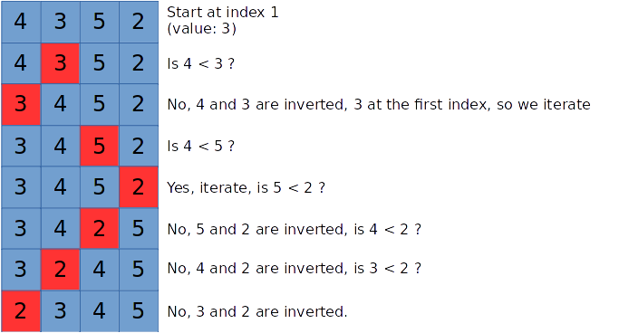

# sorting-algorithms

[](https://travis-ci.org/jean553/sorting-algorithms)


Sorting algorithms implementations.

## Installation and usage

```
cargo run [algorithm]
```

`algorithm` can be equal to:
 * `insertion`: insertion sort
 * `selection`: selection sort

Use 'Space' key to iterate and sort step by step.

## Generate documentation

```
cargo rustdoc -- --no-defaults
```

## Sorting algorithms

This project contains the implementations of:
 * the insertion sort
 * the selection sort

### Insertion sort



More details: https://en.wikipedia.org/wiki/Insertion_sort

### Selection sort

One of the simpliest sort algorithms. The selection sort iterates on every items one by one.
For each item, it browses the whole array to find a smaller item than the current one.
When the whole array has been browsed, the current item is inverted with the found minimum value
(if one value has been found).
